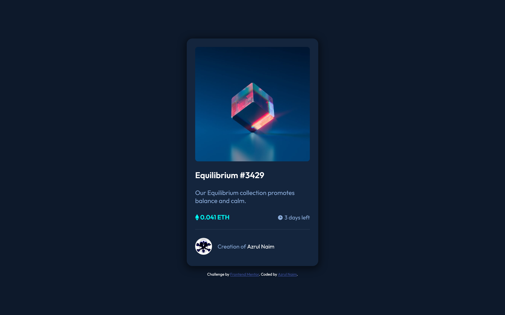

# Frontend Mentor - NFT preview card component solution

This is a solution to the [NFT preview card component challenge on Frontend
Mentor](https://www.frontendmentor.io/challenges/nft-preview-card-component-SbdUL_w0U). Frontend Mentor challenges help
you improve your coding skills by building realistic projects.

## Table of contents

- [Overview](#overview)
- [The challenge](#the-challenge)
- [Screenshot](#screenshot)
- [Links](#links)
- [My process](#my-process)
- [Built with](#built-with)
- [What I learned](#what-i-learned)
- [Useful resources](#useful-resources)
- [Author](#author)


## Overview

### The challenge

Users should be able to:

- View the optimal layout depending on their device's screen size
- See hover states for interactive elements

### Screenshot




### Links

- Solution URL: [Add solution URL here](https://your-solution-url.com)
- Live Site URL: [Add live site URL here](https://your-live-site-url.com)

## My process

### Built with

- Semantic HTML5 markup
- CSS custom properties
- Flexbox
- Mobile-first workflow


### What I learned


```html
<a class="equilibrium" href="">
  
  
</a>
```
```css
/*** 5.2 - Imagery ***/
.equilibrium {
  display: block;
  position: relative;
  border-radius: 0.5rem;
  transition: 0.5s ease;
}

.equilibrium img {
  border-radius: inherit;
  vertical-align: middle;
}

.equilibrium .overlay {
  transition: inherit;
  position: absolute;
  top: 50%;
  left: 50%;
  transform: translate(-50%, -50%);
  opacity: 0;
}


/* hover */
.equilibrium:hover {
  background-color: #00fff7;
}

.equilibrium:hover .image {
  opacity: 0.5;
}

.equilibrium:hover .overlay {
  opacity: 1;
}
```


### Useful resources

- [w3schools](https://www.w3schools.com)


## Author

- Website - [Azrul Naim](https://sjtape.github.io/)
- Frontend Mentor - [@sjtape](https://www.frontendmentor.io/profile/sjtape)
- Twitter - [@solitaryjester](https://twitter.com/solitaryjester)
- Facebook - [Azrul Naim](https://www.facebook.com/solitary69jester)
- Youtube - [Solitary Jester](https://www.youtube.com/channel/UCkoYmybPTWO92AnRl-q3hig)